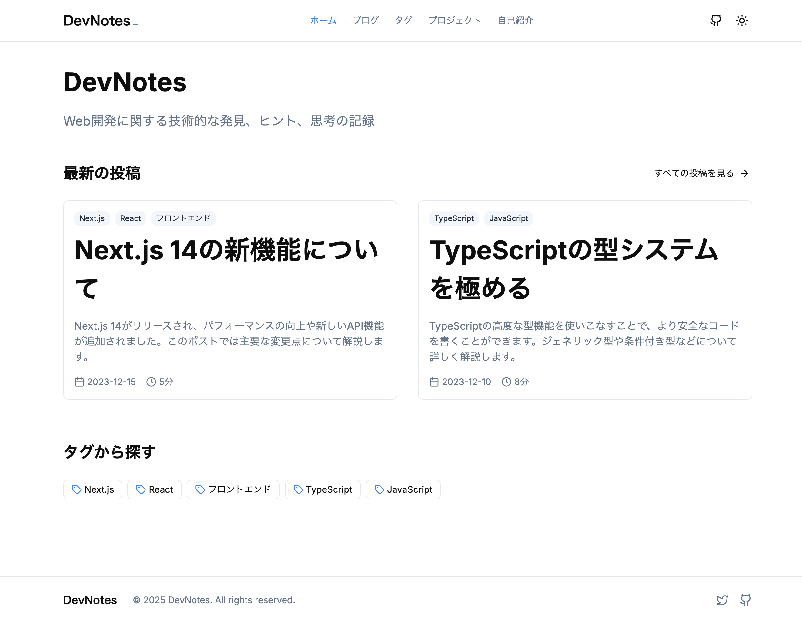
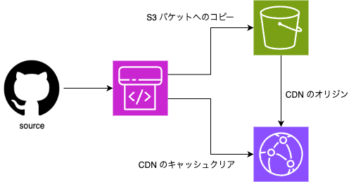

以前まで、はてなブログに記事を投稿していたのですが、いくつかの理由で2025年4月からこのブログをホストして運用しはじめました。
今回はブログに関する自分の考えや、ブログのセルフホストとそれに移行した理由、現在の運用方法について書いてみます。

割と楽しく愛着をもっていじれているので、ブログやりたいと思っている人とか、ソフトウェアの砂場みたいなものを欲している人にはおすすめかもしれません。

## これまでのブログ

まぁとにかくアウトプットが非常に少なく、ソフトウェア開発者として他者と比較してしまい、なんとなくコンプレックスに感じていました。
外部サービスのブログは SEO 観点では強いのだと思いますが、どうも時間をかけて記事を書くモチベーションが湧いてきませんでした。
そもそも、自分のブログは備忘録や自己表現（表明？）がほとんどなので、多くの人に見てもらいたい、という気持ちがほとんどありません。
このスタンスはどうなのかとは我ながら思いますが、まぁそうはいっても自分の正直な気持ちなのでしょうがないのかなと。

とはいえ、アウトプットはやはり増やしたい。
セルフホストして自分で丹精込めて運用するブログならば、ある程度のモチベーションのもと継続して投稿できるのではないかと思うに至りました。

やはり、自分で運用するサービスをもつと、色々な派生対象に対してもモチベーションが湧くので良いです。
興味のあるライブラリなんかも気軽に試せるし、今のところは Web フロントエンドだけですが、発想を広げてバックエンドや DB にも手を伸ばしていきたいところです。

## 選んだフレームワーク

[Astro](https://astro.build/) による SSG を選びました。
Astro を選んだ理由は、日々お世話になっている vim-jp の Slack にてよく話題に上がっていたのを見かけたからです。
特に、チュートリアルの出来が良いということで、まずはそれをやってみることにしました。

[Astro の日本語チュートリアル](https://docs.astro.build/ja/tutorial/0-introduction/)

このチュートリアルは、まさしくブログを0から作ってみる内容となっています。
最低限ではありますが、最後までやりとげると、十分にブログとして公開できるようなものが完成する流れとなっていました。
実は、終わったあと「このブログをこのまま育てていけばええやん」と思ったのが、今に至るきっかけでした。

デザインなどは、さすがにチュートリアルの範囲だと簡素すぎたので、あとから徐々に手を加えていきました。
今のデザインは、適当なプロンプトで [v0](https://v0.dev/) に提案してもらったものをベースとしています。
これも、最初は「v0 ってどんな感じなんだろ？」と試すだけの予定だったのですが「これでええやん」というものが出てきたので、参考にしちゃおうという軽いノリでした。

こんなのが React でサクッと出てくるの怖い。

ただ、コピペはほとんどしてなくて、久しぶりに CSS を復習して、v0 のチャットで意味を聞きながら手動で移していく、という感じですすめました。
近いうちに、学習も兼ねて全部 Tailwind CSS で書き直すことを計画中です。

## ホスティング先

仕事で AWS を使っているので、AWS でなるべく完結するようにしています。
パブリッククラウドが苦手なので、アレルギーを克服することを狙っています。
よく知らないですが、料金面とか手間を考えると、Netlify とか Cloudflare でホスティングする方が楽なのかもしれません。

構成は、わざわざ図示するほどでもないけど、描くと以下のような感じに。

S3 をオリジンとして CloudFront で CDN をかけているという感じで、まぁ素直な方法だろうと思います。
ドメインの取得も Route53 でやりました。
リポジトリだけは GitHub に置いていて、Actions は積極的に使っています。

こんなシンプルな構成でも、知らないことだらけだったので、Perplexity と対話しながら構築していきました。
LLM がない時代って、こういうのどうやって調べてたんだっけ…？
ちょっと前だったはずなのに思い出せない…。

## おわりに

これを作るまでは「いつか作る自分のブログは、ちゃんと記事も DB に永続化して、認証機能もつけてバックエンドはコンテナ化して…」などという風に考えていました。
しかし、日々のあれこれに流されてしまって、まったく前進させられませんでした。

思うに、何かを学ぶときは、なるべくそのほかを省いてシンプルをつきつめるべきだと思います。
まともな Web サービスを作ろうとすると、すぐに巨大になっていくので、格好悪くてもいいから、意識的に小さく質素なものを目指すべきだと思います。
認証も DB もコンテナも、このあと1つずつゆっくり自分事にして、半分遊びながらレベルアップしていく予定です。

さいごに、Astro はいいぞ。
