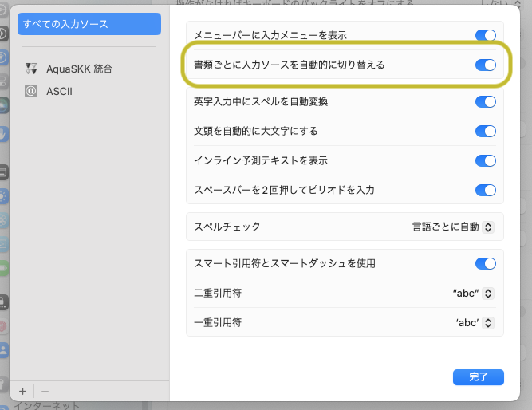

先に結論を書いてしまうと「macOS で SKK を使うなら、以下の記事を参考にして設定しましょう」ということです。
私は、著者さんと同じく AquaSKK を使っているので、記事そのままに設定しましたが、macSKK でも同様に恩恵を受けられるそうです。

[Mac で AquaSKK を Ctrl+Space で切り替えなくても良くする方法](https://zenn.dev/yoshiyoshifujii/articles/78798db6472bf4)

この記事のタイトルでピンとくる人は、もうこのあとの内容は読まなくて OK です。
一応、この記事でどれくらい助かったか、という想いを書いておきたいので、少し続きます。

## あれから

以前「[いまさら SKK に入門してみた](2025-04-01-introduce-skk)」という記事を書きました。
このときは Vim の中でのみ使うに留まっていましたが、SKK にハマってしまったらそりゃ macOS 全体でも使いたいよね、となるのは自然な流れでした。

あまりこだわりはなかったので、それなりに十分な時間の篩にかけられているだろうということで、AquaSKK を素直に選びました。
ターミナル[^1]や Vim での日本語入力は、これまで通り skkeleton を使い、それ以外の GUI アプリなどは AquaSKK に任せる、という感じです。

ただ、これまで使っていた Google 日本語入力などの IME では、アプリをまたいで IME が共通化されていました。
これにより、ターミナルとそれ以外を行き来するときに、 **ターミナルなのに AquaSKK になってしまって、困っていました。**

## この問題に対して、これまではどうしてたのか

これに関しては、ググるとすぐに有名な解決法が出てきます。
「システム設定 → キーボード」に「テキスト入力」の「入力ソース」という項目があるので、これを編集します。
すると、以下のスクショ[^2]のような設定が可能です。
ここで、黄色枠の部分の「書類ごとに入力ソースを自動的に切り替える」という項目を ON にすると、アプリごとに IME を記憶してくれます。

これにより、 **ターミナルの IME がデフォルトに固定** されるようになりました。

## 今までの設定では何が問題だったか

ターミナルのほうは固定されましたが、なぜか **ターミナルアプリ以外が安定しませんでした。**

そんな憶えはないのに、いつの間にか AquaSKK からデフォルトに戻っていることが多々ありました。
これまでの長年の手癖で、無意識的に ctrl+space で AquaSKK とデフォルトを切り替えていた…という可能性は否定しきれません。
ただ、SKK 環境においては、 SKK の中で切り替える習慣がもう出来上がっているつもりなので、やはり勝手に切り替わっているように体感していました。

また、仮に AquaSKK が継続していたとしても「今はかな入力か英数入力かどっちなんだっけ？」と、ほとんどの場合迷子になってしまいます。
いちいちアプリごとに状態を全部記憶してられないですからね。

あと、AquaSKK は「かな入力」と「英数入力」のうち、今はどちらなのか？というのを小さなインジケータで表示してくれる機能があります。
これ自体はとても便利なのですが、アプリを切り替えると、なぜかこのインジケータに嘘をつかれて混乱することが、しばしばありました[^3]。

こんな感じで、ターミナル以外では若干不安定で、やきもきすることが多かったです。

## 例の設定をしてから

先述のような悩みがほぼすべて解消されました。
**というか、IME が常に AquaSKK の英数入力に固定されるので、迷う余地がありません。**

**GUI アプリでテキスト入力をすると、最初は必ず英数入力で固定されます。**
この挙動はまだちょっと慣れないところがあるのですが、数日以内に適合出来る確信はあります。
ターミナルでは英数固定で問題なく、ctrl+j しても日本語に切り替わらず、コマンドが確定されます[^4]。

本当におすすめな設定なので、macOS で SKK を使っている人、これから使いたい人は是非試してみてください。
良き SKK ライフを！

---

[^1]: ターミナルのコマンドで日本語が使いたいときは、zsh の ZLE というやつを使っています。当時はこの記事を参考に設定しました。https://dev.classmethod.jp/articles/eetann-zle-edit-command-line/
[^2]: OS のバージョンは macOS Sonoma 14.6 です。
[^3]: 今思うと、アプリ切り替え時は英数に強制的に戻る、でもインジケータは直前の状態を引き継ぐ、という感じの挙動で一貫していたのかもしれません。でももう気にする必要がなくなったので、深掘りはしません。
[^4]: この挙動は歓迎しているけど、正直なぜこうなってくれるのかはよく分からない。
