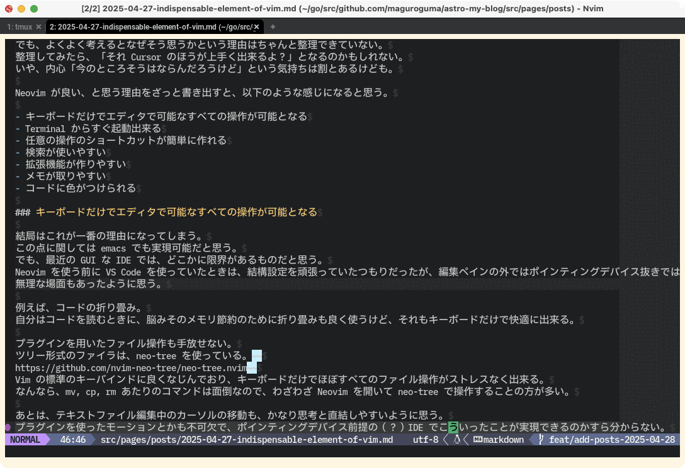
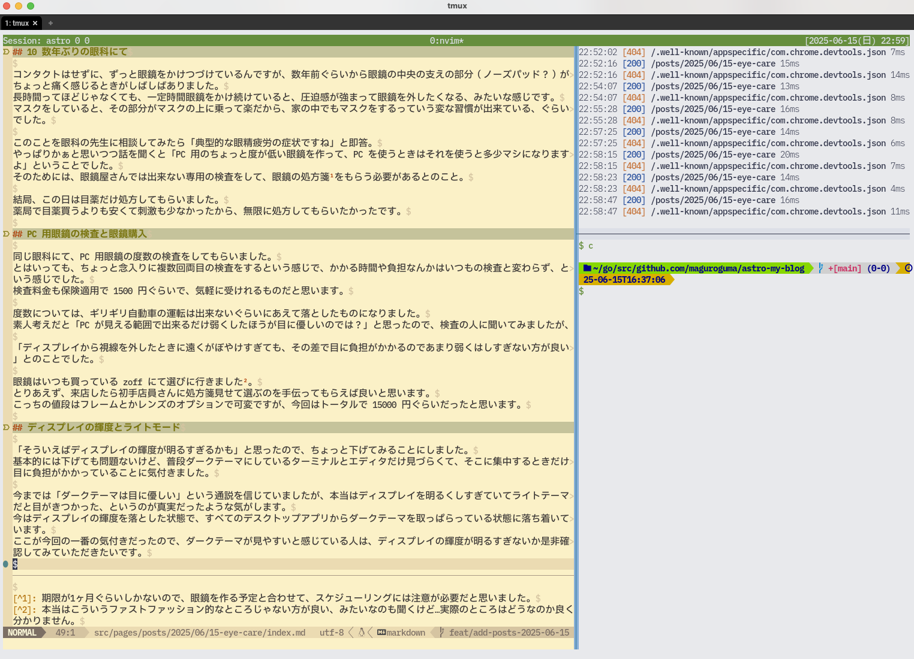

大学生のころに眼科に行ったっきり、10年以上眼科に行けていませんでした。
健康診断で簡単な目の検査はあるとはいえ、毎日10時間は軽く PC ディスプレイの前にいるので、何かしら目の病気がないか、ずっと気にしていました。

そんなこんなで、今年の5月ごろに、それまで急がしかった仕事のほうがちょっと落ち着いたので、久しぶりに眼科に行ってみました。
また、それを皮切りに、目を労るために色々やったので、それについて書いてみます。

## 10 数年ぶりの眼科にて

コンタクトはせずに、ずっと眼鏡をかけつづけているんですが、数年前ぐらいから眼鏡の中央の支えの部分（ノーズパッド？）がちょっと痛く感じるときがしばしばありました。
長時間ってほどじゃなくても、一定時間眼鏡をかけ続けていると、圧迫感が強まって眼鏡を外したくなる、みたいな感じです。
マスクをしていると、その部分がマスクの上に乗って楽だから、家の中でもマスクをするっていう変な習慣が出来ているぐらいでした。

このことを眼科の先生に相談してみたら「典型的な眼精疲労の症状ですね」と即答。
やっぱりかぁと思いつつ話を聞くと **「PC 用のちょっと度が低い眼鏡を作って、PC を使うときはそれを使うと多少マシになりますよ」** ということでした。
そのためには、眼鏡屋さんでは出来ない専用の検査をして、眼鏡の処方箋[^1]をもらう必要があるとのこと。

結局、この日は目薬だけ処方してもらいました。
薬局で目薬買うよりも安くて刺激も少なかったから、無限に処方してもらいたかったです。

## PC 用眼鏡の検査と眼鏡購入

同じ眼科にて、PC 用眼鏡の度数の検査をしてもらいました。
とはいっても、ちょっと念入りに複数回両目の検査をするという感じで、かかる時間や負担なんかはいつもの検査と変わらず、という感じでした。
検査料金も保険適用で 1500 円ぐらいで、気軽に受けれるものだと思います。

度数については、ギリギリ自動車の運転は出来ないぐらいにあえて落としたものになりました。
素人考えだと「PC が見える範囲で出来るだけ弱くしたほうが目に優しいのでは？」と思ったので、検査の人に聞いてみましたが、
**「ディスプレイから視線を外したときに遠くがぼやけすぎても、その差で目に負担がかかるのであまり弱くはしすぎない方が良い」** とのことでした。

眼鏡はいつも買っている zoff にて選びに行きました[^2]。
とりあえず、来店したら初手店員さんに処方箋見せて選ぶのを手伝ってもらえば良いと思います。
こっちの値段はフレームとかレンズのオプションで可変ですが、今回はトータルで 15000 円ぐらいだったと思います。

## ディスプレイの輝度とライトモード

「そういえばディスプレイの輝度が明るすぎるかも」と思ったので、ちょっと下げてみることにしました。
基本的には下げても問題ないけど、普段ダークテーマにしているターミナルとエディタだけ見づらくて、そこに集中するときだけ目に負担がかかっていることに気付きました。

今までは「ダークテーマは目に優しい」という通説を信じていましたが、**ディスプレイを明るくしすぎていてライトテーマだと目がきつかった** というのが真実だったような気がします。
今はディスプレイの輝度を落とした状態で、すべてのデスクトップアプリからダークテーマを取っぱらっている状態に落ち着いています。

ちょっと前はこんな真っ黒だったのが、

今はこんな感じに。

ここが今回の一番の気付きだったので、ダークテーマの方が見やすいと感じている人は、ディスプレイの輝度が明るすぎないか是非確認してみていただきたいです。

## おわりに

今回色々と目を労ってみましたが、気持ち普段の仕事も楽になったような気がします。
ソフトウェア開発の仕事はスプリントではなくマラソンだと思っていますが、先輩方の話を聞くと目の異常には抗うのが難しいようです。
出来る範囲で目を気遣って、健康なソフトウェア開発ライフを続けていきましょう。

---

[^1]: 期限が1ヶ月ぐらいしかないので、眼鏡を作る予定と合わせて、スケジューリングには注意が必要だと思いました。
[^2]: 本当はこういうファストファッション的なところじゃない方が良い、みたいなのも聞くけど…実際のところはどうなのか良く分かりません。
