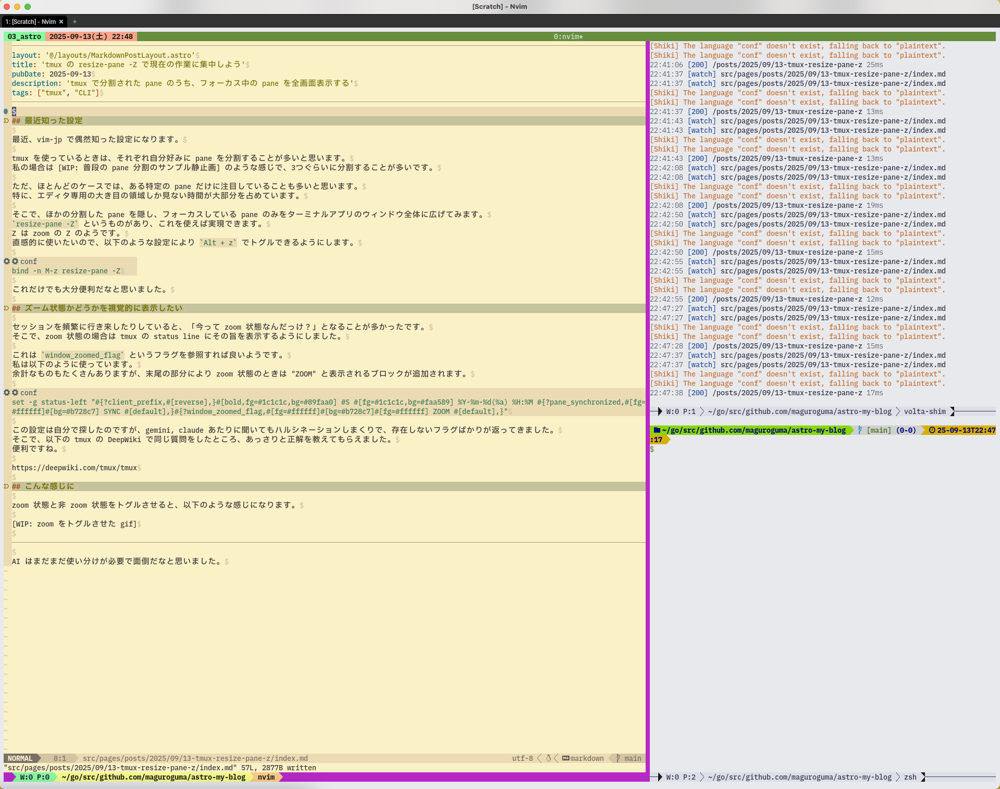
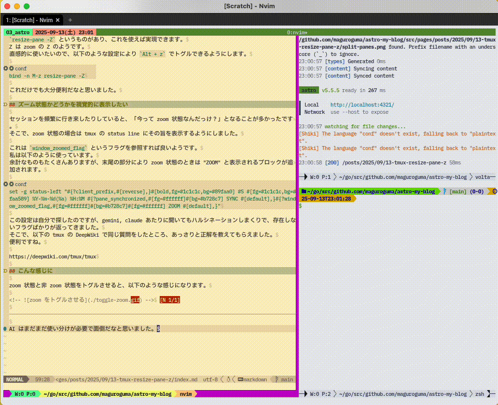

## 最近知った設定

最近、vim-jp で偶然知った設定になります。

tmux を使っているときは、それぞれ自分好みに pane を分割することが多いと思います。
私の場合は以下のような感じで、3つぐらいに分割することが多いです。



ただ、ほとんどのケースでは、ある特定の pane だけに注目していることも多いと思います。
特に、エディタ専用の大き目の pane しか見ない時間が大部分を占めています。

そこで、ほかの分割した pane を隠し、フォーカスしている pane のみをターミナルアプリのウィンドウ全体に広げてみます。
`resize-pane -Z` というものがあり、これを使えば実現できます。
Z は zoom の Z のようです。
直感的に使いたいので、以下のような設定により `Alt + z` でトグルできるようにします。
これだけでも大分便利だなと思いました。

```conf
bind -n M-z resize-pane -Z
```

## ズーム状態かどうかを視覚的に表示したい

セッションを頻繁に行き来したりしていると、「今って zoom 状態なんだっけ？」となることが多かったです。
そこで、zoom 状態の場合は tmux の status line にその旨を表示するようにしました。

このためには `window_zoomed_flag` というフラグを参照し、判定させれば良いようです。
私は以下のように使っています。
余計なものもたくさんありますが、末尾の部分により zoom 状態のときは "ZOOM" と表示されるブロックが追加されます。

```conf
set -g status-left "#{?client_prefix,#[reverse],}#[bold,fg=#1c1c1c,bg=#89faa0] #S #[fg=#1c1c1c,bg=#faa589] %Y-%m-%d(%a) %H:%M #{?pane_synchronized,#[fg=#ffffff]#[bg=#b728c7] SYNC #[default],}#{?window_zoomed_flag,#[fg=#ffffff]#[bg=#b728c7]#[fg=#ffffff] ZOOM #[default],}"
```

この設定は自分で探したのですが、gemini, claude あたりに聞いてもハルシネーションしまくりで、存在しないフラグばかりが返ってきました。
そこで、以下の tmux の DeepWiki で同じ質問をしたところ、あっさりと正解を教えてもらえました。
便利ですね。

https://deepwiki.com/tmux/tmux

## 最終的にこんな感じに

zoom 状態と非 zoom 状態をトグルさせると、以下のような感じになります。
よければ参考にしてみてください。


