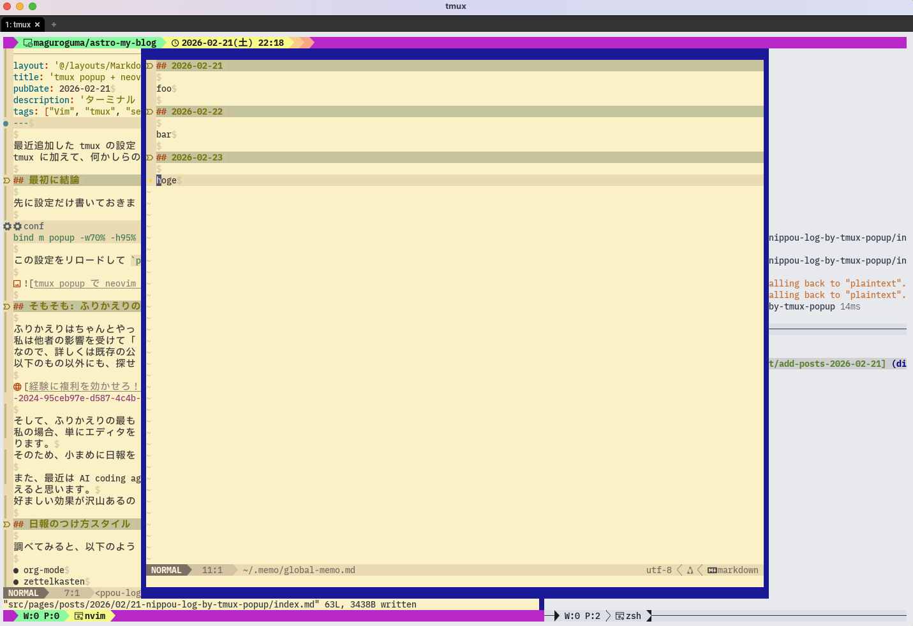

最近追加した tmux の設定がとても良かったので、簡単に紹介してみます。
tmux に加えて、何かしらのターミナルエディタを使っている人には大変おすすめです。

## 最初に結論

先に設定だけ書いておきます。

```conf
bind m popup -w70% -h95% -E -d "#{pane_current_path}" nvim $HOME/.memo/global-memo.md
```

この設定をリロードして `prefix-key -> m` とタイプすれば、スクショのような感じで neovim が開きます。



## そもそも: ふりかえりの重要性

ふりかえりはちゃんとやった方が良いと思います。
私は他者の影響を受けて「ちゃんと続けてみようか」となった人です。
なので、詳しくは既存の公開されている資料にゆずります。
以下のもの以外にも、探せば沢山あると思います。

[経験に複利を効かせろ！ふりかえり研修2024 - Speaker Deck](https://speakerdeck.com/pokotyamu/furikaeri-2024-95ceb97e-d587-4c4b-a4ec-5e52672644f6)

そして、ふりかえりの最も基本的な単位は、日々の日報になると思います。
私の場合、単にエディタを開いて何かを常に書いていないと、いつの間にか集中が乱されてしまうという事情もあります。
そのため、小まめに日報を更新することは、集中力維持装置としての役割も担っていたりします。

また、最近は AI coding agent のおかげで、日報を読んでまとめてもらうことで、職務経歴書の更新なんかにも使えると思います。
好ましい効果が沢山あるので、やはり日報をつけるのはおすすめです。

## 日報のつけ方スタイル

調べてみると、以下のような方法（形式？）を採用している人がいるかと思います。

- org-mode
- zettelkasten
- obsidian

正直、ツールと形式が混じちゃってるんだろうなぁってぐらい、それぞれについてちゃんと理解できていないです。
これらには何度もチャレンジしようとしてきたのですが、こういう形式を維持することは、私にとって認知負荷が高すぎました。
色々試した結果、私は単一のファイルにひたすら追記していく append only なスタイルがマッチしていました。

ということで、冒頭の設定のように「global なメモファイルを開くように設定しておけば良いじゃん」となったわけです。
1ヶ月毎に、ちょうど log rotation をするように、過去の日報をアーカイブしていく、というような運用を行っています。

## おまけ

もともと、以下のように lazygit などの TUI ツールを tmux popup で開くようにはしていました。
ツールによるとは思いますが、これらも便利に使えています。

```conf
bind g popup -w95% -h95% -E -d "#{pane_current_path}" lazygit
bind f popup -w95% -h95% -E -d "#{pane_current_path}" vifm
```
