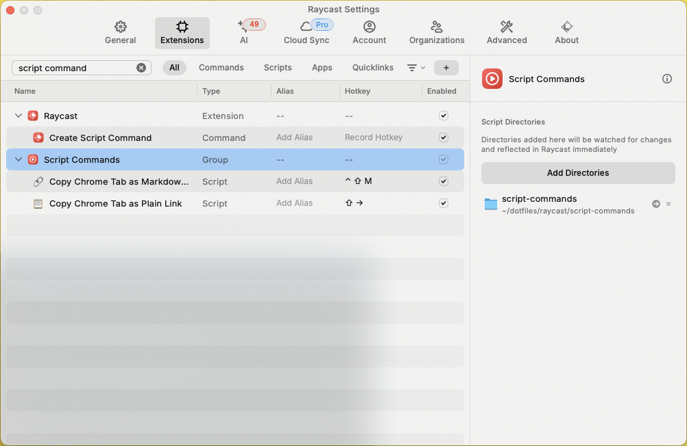
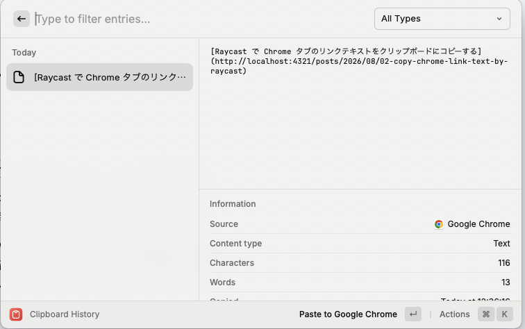

mac 限定になっちゃうけど、もしかしたらほかのプラットフォームでも似たようなことは出来るかもしれない…。

## やりたかったこと

今見ている chrome のタブに対して `[ページタイトル](リンクテキスト)` という文字列が取得したい。

普通にやるなら、link は cmd+l → cmd+c で取れて、タイトルはなんやかんやして取れる。
こういった操作を、Markdown のメモ書きを残すときに毎回やるのはめんどくさい。

あんまり詳しくないけど、こういうことをやってくれる chrome 拡張は沢山あると思う。
けど、個人的にはインストールする chrome 拡張は最小限に留めておきたい。
あとは、自分が今勤めているところだと、google workspace 側で許可されていない chrome 拡張はブロックされていたりする。
ので、すでに許容されているほかの手段をベースとしたかった。

## Raycast で実現する

みんな大好き Raycast には script commands というものがある（というのを Claude に教えてもらった）。



hotkey 経由で、気軽にシェルスクリプトを動かすことが出来る機能、という感じ、多分。
これで、以下のような osascript 中心のスクリプトを登録しておく。

これとは別に、create script とかで、Raycast のウィザードでスクリプトを作ったり登録したりもできるっぽい。
けど、それだとなんかトラブったので完成品を集めたディレクトリを登録するほうが簡単だと思う。

```sh
#!/bin/bash

# Required parameters:
# @raycast.schemaVersion 1
# @raycast.title Copy Chrome Tab as Markdown Link
# @raycast.mode silent

# Optional parameters:
# @raycast.icon 🔗

result=$(osascript <<'EOF' 2>&1
tell application "Google Chrome"
    set theTitle to title of active tab of front window
    set theURL to URL of active tab of front window
end tell

set theText to "[" & theTitle & "](" & theURL & ")"
set the clipboard to theText
return theText
EOF
)

if [ $? -eq 0 ]; then
    osascript -e 'on run argv
        display notification (item 1 of argv) with title "Copied to clipboard"
    end run' "$result"
else
    osascript -e 'on run argv
        display notification (item 1 of argv) with title "Error"
    end run' "$result"
fi
```

クリップボード管理も、これまた Raycast の clipboard history を使うと、より快適になる。



以上です。
